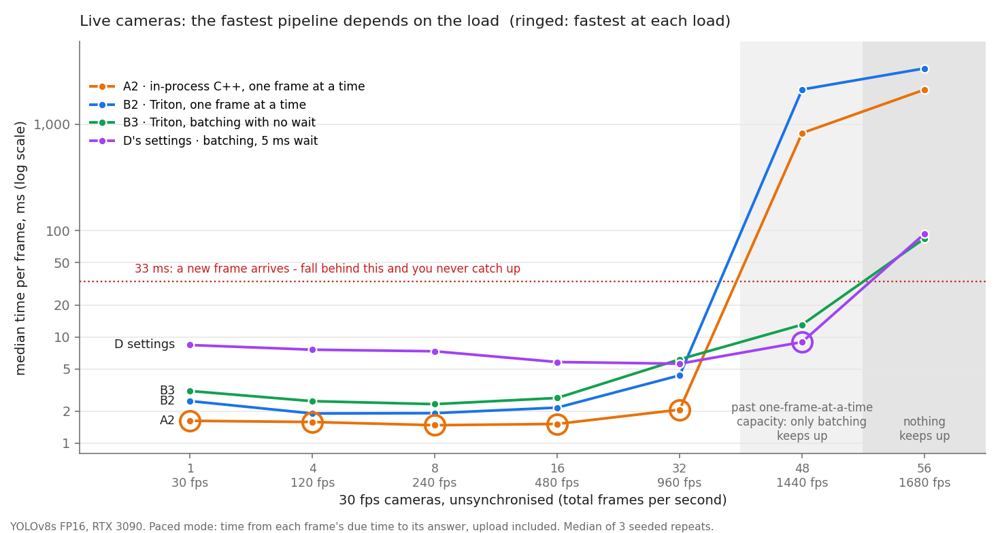

# Triton vs Pure TensorRT vs DeepStream — Inference Pipeline Benchmark

**📖 [Read this as a site](https://sadbodhs.github.io/computer_vision_optimization/overview/)** — searchable, with an interactive version
of the chart below.

One question, answered with measurements: *for the same YOLO model on the same
GPU, which serving pipeline processes a frame fastest, and which delivers the
most frames per second?*

Hardware: RTX 3090 · Triton 24.12 · TensorRT 10.7/10.3 · DeepStream 7.1 ·
**YOLOv8s** FP16 @ 640×640 (identical ONNX, md5-verified across flows).
Everything runs in Docker.

**New to this?** Start with [Introduction](docs/introduction.md) — what these
stacks are, why the choice is hard, and why "fastest" is not a well-formed
question. Building something specific? [Use cases](docs/use-cases.md) maps
robotics, surveillance, manufacturing and the rest onto a pipeline. Then
[STORY.md](STORY.md) for the narrative of how the first answer
turned out to be wrong, and what it took to get a trustworthy one.


*Up and to the left is better.* Each line is one pipeline swept over concurrency
1–16. Full tables in [Results](docs/results.md).

---

## Index

| Doc | Question it answers | Headline finding |
|---|---|---|
| [Introduction](docs/introduction.md) | Why does this choice even matter? | The plumbing costs more than the model; "fastest" depends on latency vs throughput |
| [Use cases](docs/use-cases.md) | Which of these is for *my* problem? | Four binding constraints; in three of them the lowest-latency pipeline is the wrong pick |
| [Methodology](docs/methodology.md) | How were these numbers produced? | A benchmark that saturates the source measures the source |
| [Results](docs/results.md) | How fast is each pipeline? | A2 lowest latency (1.23 ms); D highest throughput (1665 fps) |
| [DeepStream](docs/deepstream.md) | What does NVIDIA's own stack do? | 1.50 ms/frame, zero custom code, source-bound at 5.4% GPU |
| [Transport](docs/transport.md) | Which shared memory, and when? | CPU data → sys-shm (3.6×); GPU data → CUDA IPC (3×) |
| [Moving fewer bytes](docs/fewer-bytes.md) | Why is the tensor that big? | UINT8 input + in-graph /255 cuts the wire 4x for free: +87.6% on B1, 0% on D, +0.0001 mAP |
| [Stage decomposition](docs/stage-decomposition.md) | Where does the time actually go? | With zero-copy, Triton's whole framework costs 0.18 ms |
| [Model cost](docs/model-scaling.md) | When does the plumbing stop mattering? | Non-engine cost is fixed at 0.256 ms; A2 crosses under 10% at a 2.3 ms engine, B1 not until 10.4 ms |
| [Across architectures](docs/model-zoo.md) | What sets the plumbing cost? | Output bytes / 25 GB/s — and output shape is an architectural choice: DeepLabV3 pays 57% transport, SegFormer-B0 14%, at the same engine cost. Params predict engine time at r&sup2; 0.80 in bulk, but ResNet50 and YOLO11l share 25M and differ 5.8x |
| [Batching](docs/batching.md) | Is dynamic batching free? | No — 37% cheaper GPU/frame, paid in 6–74 ms added latency (mostly in-flight depth, not queue) |
| [Live traffic (B3)](docs/live-batching.md) | What does batching cost a live camera? | ~0.5 ms with a zero window, ~5.5 ms with D's 5 ms window; past B2's capacity it is 13 ms against 2 s |
| [Triton tuning](docs/triton-tuning.md) | Were the Triton knobs right? | `count:2` validated (+30% over 1); graphs and instances are substitutes |
| [CUDA graphs](docs/cuda-graphs.md) | Is the engine ceiling real? | No — ~0.13 ms of it is launch overhead; +11.8% inside A2, and its plateau rises 1167→1249 fps |
| [In-graph NMS](docs/in-graph-nms.md) | Is the 2.82 MB output worth removing? | On raw gRPC yes — +33% despite a 19% slower engine; on zero-copy paths, no |
| [Contention](docs/contention.md) | What if N pipelines share the GPU? | MPS gives A2 +32% but B2 nothing — Triton's edge inverts once MPS is on |
| [Manufacturing inspection](docs/inspection.md) | What does a label-free visual QA line cost to serve? | **Now its own study** ([site](https://sadbodhs.github.io/manufacturing_inspection/)): ~10 cameras per 3090 at 4 parts per frame; TensorRT brute force beats FAISS/cuVS for PatchCore's search; the rare heavy stage sets the tail |
| [Accuracy](docs/accuracy.md) | Does the pipeline preserve the model? | Yes, for every model and both engine shapes; batching is accuracy-free; nearest-neighbour resize cost ~0.6 mAP (fixed) |
| [Precision](docs/precision.md) | Is INT8 worth it? | +32.8% throughput for −1.55 mAP — and it beats downgrading the model; sparsity ~+1%, not worth it |
| [Reproduce](docs/reproduce.md) | How do I run this myself? | Four commands from a clean clone |
| [On another GPU](docs/other-gpus.md) | Do these numbers apply to my card? | Timers and software behaviour carry over; shapes carry over; positions do not. Keep A2/B2 under ~80% GPU utilisation |
| [Decoder capacity](docs/nvdec.md) | How many cameras can NVDEC decode? | No session limit; ~768 fps at 1080p (25 cameras at 30 fps), ~2,530 at 640×360 (84). At 1080p the decoder, not the detector, caps one 3090 |
| [Roadmap](docs/roadmap.md) | What is *not* covered? | No accuracy axis, no INT8; MPS and CUDA graphs now measured |

**Two reading paths.** Start-to-finish: the table above is in reading order —
why it matters, then how it was measured, then what was measured, then what it
costs. Or jump straight to the row that matches your question.

Supporting material: [`results/`](results/README.md) (raw data + provenance) ·
[`docker/`](docker/README.md) (container recipes).

---

## The contenders

Naming used everywhere in this repo:

| ID | Name | Decode | Preprocess | Transport | Inference | Postprocess |
|----|------|--------|-----------|-----------|-----------|-------------|
| **A1** | **C++ TRT, CPU path** | NVDEC → CPU NV12 | swscale + CPU loops | none (in-proc) | TensorRT `enqueueV3` | CPU NMS |
| **A2** | **C++ TRT, full-CUDA** | NVDEC **zero-copy** (GPU frames) | fused CUDA kernel → TRT input buffer | none (in-proc) | TensorRT, same CUDA stream | GPU compact kernel, KB of boxes to host |
| **B1** | **Triton + C++ client** | NVDEC → CPU NV12 | swscale + CPU loops | gRPC (raw payloads) | Triton `tensorrt_plan` | CPU NMS |
| **B2** | **Triton + C++ client + CUDA shm** | NVDEC **zero-copy** | CUDA kernel → **CUDA IPC shm region** | gRPC (handles only) | Triton `tensorrt_plan` | GPU compact kernel on shm output |
| **C1** | Triton + Python torch *(superseded)* | ffmpeg pipe | torch GPU + H2D/D2H | gRPC raw | Triton | torch + NMS |
| **C2** | **Triton + Python numpy + sys-shm** | ffmpeg pipe | **pure numpy** (no GPU) | **system shared memory** | Triton `tensorrt_plan` | numpy NMS, multiprocessing |
| **D** | **Triton + async + dynamic batching** | NVDEC **zero-copy** | CUDA kernel → CUDA shm | gRPC async, 8 in-flight | Triton **batch-8 engine** | GPU compact kernel |
| **E1** | **DeepStream, 1 stream** | `nvv4l2decoder` (NVMM) | `nvinfer` (1/255, AR, sym-pad) | none (GStreamer) | TensorRT via `nvinfer` | marcoslucianops YOLO parser |
| **E2** | **DeepStream, N-stream batched** | same × N | `nvstreammux` batch | none (GStreamer) | TensorRT batch-N | same |

### How each flow feeds the GPU

The table above is about *plumbing*. This one is about *load*, and a Triton user
needs it before reading any latency number, because it explains most of them:

| ID | Requests in flight per stream | Server-side batching | Engine batch shape | Execution contexts |
|----|---|---|---|---|
| A1, A2 | 1 (in-process) | none | fixed 1 | 1 per stream (one thread each) |
| B1, B2 | 1 (synchronous client) | **off** — `max_batch_size: 0` | fixed 1 | 2 Triton instances, shared |
| C1, C2 | 1 per process (synchronous) | **off** | fixed 1 | 2 Triton instances, shared |
| **D** | **8 (async client)** | **dynamic** — preferred `[4, 8]`, 5 ms window | dynamic 1–8 | 2 Triton instances, shared |
| **B3** | 1 per camera (synchronous, paced) | **dynamic** — 0 µs or 500 µs window | dynamic 1–8 | 2 Triton instances, shared |
| E1, E2 | GStreamer pipeline | E1 none · E2 `nvstreammux` batch-N | E1 fixed 1 · E2 up to N | `nvinfer` |

Two consequences to hold onto when reading the tables:

- **"Concurrency N" means N client streams, not N requests.** Frames actually in
  flight equal N for every flow except D, where they are **8 × N**. At
  "concurrency 1", D is holding eight frames and B2 is holding one.
- **"Batch-8" is D's ceiling, not what it runs.** Triton forms batches of exactly
  4.00 at 1–4 streams and reaches ~8 only from 8 streams
  ([measured](docs/batching.md#what-batch-size-does-d-actually-form)).

**Reference ceiling**: `trtexec` on the batch-1 engine = **0.97 ms/frame,
1028 fps**; the batch-8 engine = **0.61 ms/frame** (1630 fps effective). Every
number below is the story of what stands between your camera and that 0.97 ms.

## Headline numbers

Capacity mode, YOLOv8s FP16. Full tables: [Results](docs/results.md).

**Capacity mode** replays frames flat-out and closed-loop: each client sends its
next request the moment a slot frees. It measures how much a pipeline can
process — not how long a frame from a live camera would wait.

| Flow | Best latency (p50) | Best throughput | In one line |
|---|---|---|---|
| **A2** C++ TRT full-CUDA | **1.23 ms** | 1219 fps; **1622 fps at batch 8** | Lowest latency, in-process control, zero dependencies |
| **B2** Triton + CUDA shm | 1.28 ms‡ | 1131 fps | Triton without the tax — ≈A2 latency, plus server ops |
| **C2** Triton + numpy + sys-shm | 1.69 ms | 1038 fps | Python within 0.4 ms of C++ |
| **D** Triton async + dynamic batching | 6.2–74 ms† | **1665–1816 fps** | Highest throughput; latency is the price |
| **E1** DeepStream | 1.50 ms | 45 fps/stream (source-bound) | Zero custom code, integrated NVDEC→infer |
| B1 raw gRPC · C1 torch | 3.27 / 6.4 ms | 496 / 225 fps | What "just use the server" costs if you feed it naively |

† D's latency is end-to-end p50 with the client holding **8 frames in flight per
stream**, so it is mostly those frames queued behind each other (Little's law:
8 × streams ÷ throughput) — not batch-window wait, which is capped at 5 ms. A live
camera has one frame in flight and would not see these numbers — under live
traffic batching costs ~0.5 ms with a zero window and ~5.5 ms with D's 5 ms one
([measured](docs/live-batching.md)).

‡ Not like-for-like: A2's clock starts before the frame's upload to the GPU, B2's
after it. On the same clock, A2 is **0.3–0.9 ms faster per frame**
([measured](docs/live-batching.md#6-choosing-a2-b2-or-b3-at-each-load)).

**The headline conclusion** *(corrected 2026-09-28)*: fed properly (CUDA-shm
zero-copy plus async clients keeping batches full), Triton reaches the study's
highest single-model throughput, **and a batched in-process C++ pipeline ties it**:
1,622 vs 1,624 fps, at 10 ms p50 against D's 37 ms. The "~50% over hand-rolled C++"
first published here compared D at batch 8, and on three models, with C++ at batch 1
on one; the lead was the batch size
([correction](docs/batching.md#correction-the-throughput-lead-is-batching-not-triton)).
The same server with a naive client still loses by 8×. Triton's framework is only as
good as its client; whether its multi-model scheduler beats a hand-rolled one is
untested.

### Live cameras rank the pipelines differently

Capacity mode asks how much a pipeline can process. A live camera asks something
else: how long does *its* frame wait, with one frame in flight and a new one every
33 ms? Paced mode measures that — virtual 30 fps cameras, each frame timed from the
moment it is due, upload included ([live traffic](docs/live-batching.md)).



| 30 fps cameras | A2 | B2 | B3 · 0 µs | D's settings (5 ms window) |
|---|---|---|---|---|
| 8 (240 fps) | **1.48** | 1.92 | 2.33 | 7.33 |
| 32 (960 fps) | **2.07** | 4.35 | 6.15 | 5.60 |
| 48 (1,440 fps) | 827 | 2,124 | 13.0 | **8.95** |

*Median ms per frame, unsynchronised cameras, median of 3 seeded repeats.*

- **Below capacity, one frame at a time wins** — and in-process wins by another
  0.3–0.9 ms. Batching can only add waiting there: ~0.5 ms with no window, ~5.5 ms
  with D's 5 ms one.
- **Past a one-frame-at-a-time pipeline's capacity, its queue grows without
  limit** — B2's median frame is 2 s late at 48 cameras — while every batching
  config stays at 9–13 ms. Bigger batches free GPU time, and near capacity that
  *is* latency.
- **When cameras fire together**, batching bounds the tail (13–24% lower p99 in
  synchronised bursts) and A2 falls behind.

So the pipeline is chosen by the load you will run at, and a short batching window
is cheap insurance if that load can spike. Per-load picks, bursts and p99:
[choosing A2, B2 or B3](docs/live-batching.md#6-choosing-a2-b2-or-b3-at-each-load).

## Decision guide

| Scenario | Pick | Latency (p50/frame) | Throughput | Why this pick |
|---|---|---|---|---|
| Live camera, lowest latency, full control | **A2** — C++ TRT full-CUDA | **1.23 ms** | 809 fps | fastest per frame; zero dependencies |
| Live multi-stream, want a server | **B2** — Triton + CUDA shm | 1.28 ms‡ | 1131 fps | ≈A2 latency + Triton ops (reload, metrics) |
| Live cameras, bursts or load spikes possible | **B3** — B2's client + 0 µs dynamic batching | ~0.5 ms over B2 (paced mode) | bounded to ~1,650 fps | bounded tail in bursts; survives past B2's ~1,131 fps ([measured](docs/live-batching.md)) |
| Python-only team | **C2** — Triton + numpy + sys-shm | 1.69 ms | 1038 fps | within 0.4 ms of C++ with pure-Python client |
| Offline / max throughput, one model | **A2 at batch 8** or **D** (a tie) | A2: 10 ms · D: 37 ms† | ~1,620 fps both | same batch-8 engine; A2 in-process with a quarter of D's latency, D if you want a server ([measured](docs/batching.md#correction-the-throughput-lead-is-batching-not-triton)) |
| Multi-model production serving | **D** — 3 models × async, dynamic batching | 29–59 ms† | **1799–1816 fps** | Triton's scheduler; no batched hand-rolled equivalent was built to compare |
| Edge product, NVIDIA-supported stack | **E** — DeepStream | 1.50 ms (1 stream) | 45 fps/stream (source-bound) | zero custom code; NVDEC→infer integrated |

At 30 FPS live video (33.3 ms budget) *every* flow keeps up — the differences are
in latency headroom, not capability.

## Six things we'd tell ourselves at the start

1. **A benchmark that saturates the source measures the source.**
2. **Latency and throughput are different products** — D's 1665 fps and its 74 ms
   latency are the same number read two ways, and literally so: latency ≈
   in-flight requests ÷ throughput ([Little's law](docs/batching.md#where-ds-latency-actually-goes)).
   Most of it is the client's own 8-deep window, not Triton's batching queue.
3. **The GPU is almost never the bottleneck at the edge.** The fight is over PCIe
   round trips, serialization, and interpreter locks.
4. **Match preprocessing bit-for-bit before comparing pipelines.**
5. **Dynamic batching needs requests that arrive together — not async clients**
   *(corrected 2026-09-28)*. We first wrote that sync clients pay for the window
   and never collect the benefit. True of one client; but many live cameras, each
   synchronous with one frame in flight, still form batches once load is high —
   13 ms per frame against 2 s at 48 cameras ([B3](docs/live-batching.md)).
6. **Shared memory: pick by data location.** CPU → system shm; GPU → CUDA IPC.

## Reproduce

```bash
docker/build.sh                              # build both images from source
scripts/export_models.sh                     # pt -> ONNX -> FP16 .plan
scripts/make_frames.sh videos/real.mp4 500   # capacity-replay input
scripts/benchmark_v2.sh 10 3                  # the full 4-arm sweep
```

Details, per-arm commands, and the source→binary map: [Reproduce](docs/reproduce.md).

## Scope

This study covers the **serving and transport layer**, at FP16, for detection on a
single GPU — no longer at a single engine cost, since it now sweeps a
[model-cost ladder](docs/model-scaling.md) and
[22 models across four tasks](docs/model-zoo.md). It has an
[accuracy axis](docs/accuracy.md), including calibrated INT8. MPS, CUDA graphs,
[in-graph NMS](docs/in-graph-nms.md) and the INT8/sparsity ceilings are measured.

**Still not covered:** input resolution (deliberately — a well-understood
quadratic), application-level tricks like detect-and-track, multi-GPU, and an
accuracy axis for segmentation. Those limits are enumerated honestly in the
[Roadmap](docs/roadmap.md).
