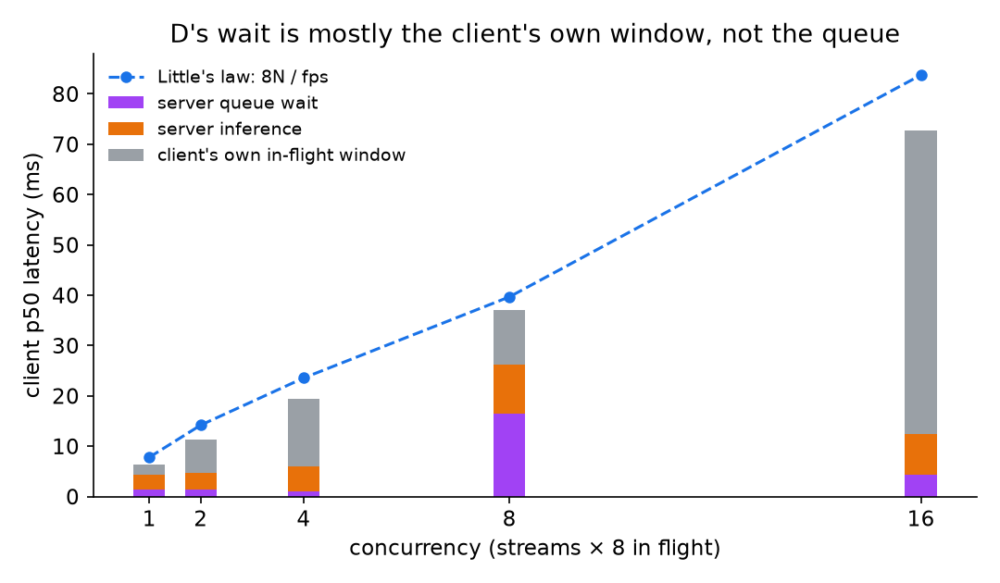

# Batching — the trap, and Triton at its best

[← index](../README.md) · prev: [Across architectures](model-zoo.md) · next: [Live traffic (B3)](live-batching.md)

Dynamic batching is where Triton either wins the whole study or loses to a
200-line C++ program. Which one depends entirely on the client.

---

## Where D's latency actually goes

[Results](results.md#capacity-results) labels D's latency `wait`, which reads as
time spent in Triton's batching queue. The client measures
`callback - send_ts` ([`grpc_async_client.cu:169`](../cpp/src/grpc_async_client.cu))
— the **whole round trip**. Triton's own per-request counters say how much of
that is really the queue:

| Concurrency | fps | client p50 | **server queue** | queue as % | in-flight | Little's law |
|---|---:|---:|---:|---:|---:|---:|
| 1 | 1027.8 | 6.28 ms | **1.294 ms** | 20.6% | 8 | 7.78 ms |
| 2 | 1128.2 | 11.29 ms | **1.304 ms** | 11.5% | 16 | 14.18 ms |
| 4 | 1359.1 | 19.38 ms | **1.073 ms** | 5.5% | 32 | 23.54 ms |
| 8 | 1613.7 | 37.10 ms | 16.370 ms | 44.1% | 64 | 39.66 ms |
| 16 | 1528.3 | 72.65 ms | **4.358 ms** | 6.0% | 128 | 83.75 ms |

Script: [`d_decompose.sh`](../scripts/d_decompose.sh) → raw data:
[`results/v3/d_latency_decomposition.tsv`](../results/v3/d_latency_decomposition.tsv).
Figure: [`plot_page_figs.py`](../scripts/plot_page_figs.py).



**At concurrency 4, the batching queue accounts for 5.5% of the latency.** The
other 94.5% is not the server waiting for batch-mates.

### It is Little's law on the client's own window

The async client holds `DEPTH = 8` requests in flight *per stream*
([`grpc_async_client.cu:132`](../cpp/src/grpc_async_client.cu)), so at N streams
there are 8N outstanding. Little's law then fixes the latency:

> latency ≈ in-flight ÷ throughput

That last column is `8N / fps`, computed with no reference to the measurement,
and it tracks the observed p50 across a **12x range** — consistently 10-15%
high, which is the right sign for a p50 against a mean-based law.

So D's latency is a property of **how many requests the client chooses to keep in
flight**, not of the batching window. Halve `DEPTH` and the latency roughly
halves; throughput falls too, because the batches have less to draw on. The
README's second lesson — *D's 1665 fps and its 74 ms are the same number read two
ways* — turns out to be literally true, as a ratio, and for a different reason
than the one originally given.

### What this does not change

The **advice is unaffected**. D really does answer in 6-74 ms, that really is too
slow for a control loop, and the throughput really is the highest measured. Only
the *mechanism* was mislabelled: the cost is pipelining depth, not queue time.

It does change one practical thing. If D's latency is what rules it out for you,
the lever is **`DEPTH`**, which is a client constant, not
`max_queue_delay_microseconds`, which is where you would naturally reach first
and which [the knob sweep](#the-batching-knobs-swept) already showed barely moves anything.

### One number that does not fit

Concurrency 8 reports 16.4 ms of queue — far out of line with 1.07 ms at
concurrency 4 and 4.36 ms at 16, and the only row where the queue is the largest
term. It reproduced across runs. It is left in rather than smoothed, because an
unexplained 44% is more useful to a reader than a tidy table, but it is not
understood and should not be built on.

## What batch size does D actually form?

The study calls flow D "batch-8" throughout, because `yolov8s_dyn` is built on a
batch-8 engine with `max_batch_size: 8`. That is what the server is *allowed* to
do. Triton's own counters say what it *did*:

| Concurrency | fps | executions | **mean batch formed** |
|---|---:|---:|---:|
| 1 | 1023.0 | 2558 | **4.00** |
| 2 | 1126.8 | 2818 | **4.00** |
| 4 | 1340.4 | 3354 | **4.00** |
| 8 | 1619.6 | 2033 | 7.97 |
| 16 | 1580.9 | 2367 | 6.68 |

Mean batch is `nv_inference_count / nv_inference_exec_count` scraped from
Triton's metrics endpoint either side of each run
([`batch_achieved.sh`](../scripts/batch_achieved.sh) ->
[`results/v3/batch_achieved.tsv`](../results/v3/batch_achieved.tsv)).

**At concurrency 1-4 the batch is 4, not 8** - and exactly 4.00, not an average
that happens to land near it. That is `preferred_batch_size: [4, 8]` doing its
job: Triton takes the smaller preferred size rather than hold the queue open
waiting for eight. Only at concurrency 8 does it fill (7.97), and at 16 it falls
back to 6.68 as the queue outruns the window.

So "D is batch-8" is true of the configuration and true of the measurement only
at concurrency >= 8. Below that, D's per-frame GPU cost is the batch-4 cost,
which is higher than the 0.61 ms batch-8 figure quoted in
[results](results.md#capacity-results).

### Why the duration counters cannot be read as per-frame service

Tempting, and wrong: Triton credits **every request in a batch with the whole
batch's execution time**, so `compute_infer_duration_us / requests` returns the
batch execution time, not the per-frame cost. At concurrency 1 that is 3.08 ms -
for a batch of four, i.e. ~0.77 ms/frame, against the batch-8 engine's 0.61 ms.
The raw TSV keeps the columns so the arithmetic is checkable, but they are
labelled per-frame only in the sense Triton means it, which is not the sense a
reader expects.

### One measurement that was not reproducible

The first pass recorded **554.7 fps at concurrency 16**, which would have been a
dramatic collapse. It was an artefact: the concurrency-8 arm leaves a deep queue
(16.3 ms/frame of accumulated wait), and the next arm started before it drained.
Three clean re-runs put concurrency 16 at 1649.7 / 1561.1 / 1641.0 fps. The
script now sleeps between arms. Recorded because a benchmark that does not let
the previous arm finish is exactly the class of error this study exists to
document.


## The trap

The batch-8 engine costs 4.84 ms for eight frames — 0.61 ms each, **37% cheaper
per frame** than running solo. Free lunch, apparently.

Our first attempt at flow D came out *slower* than the plain batch-1 server.

**Batching is a bus, and buses need passengers to arrive together.** The
synchronous clients sent one request, blocked, read the answer, then sent the
next. Requests trickled in one at a time, the 5 ms batching window expired empty,
and every request paid the window's latency while riding alone.

> **Dynamic batching requires async in-flight clients.** A sync client pays for
> the batching window and never collects the benefit.

The fix: an **async client with eight requests in flight** per stream. Requests
co-arrive, batches fill, and the same server delivers **1665 fps — the highest
number in the entire study**. It was first written up as "the only configuration
that beats in-process C++"; that compared it with C++ at batch 1, and C++ given the
same batch-8 engine ties it
([correction below](#correction-the-throughput-lead-is-batching-not-triton)).

## The bill, in the latency column

Those 1665 frames each took 6–74 ms from submission to answer
(**not** all of it queue wait — see
[where D's latency actually goes](#where-ds-latency-actually-goes)):

| Concurrency | Total fps | Queue wait (p50) | GPU service/frame |
|---|---|---|---|
| 1 | 1041 | 6.2 ms | 0.61 ms |
| 2 | 1136 | 11.1 ms | 0.61 ms |
| 4 | 1378 | 19.2 ms | 0.61 ms |
| 8 | 1640 | 36.6 ms | 0.61 ms |
| 16 | 1665 | 73.9 ms | 0.61 ms |

**Batching converts latency into throughput.** For offline analytics that is the
best trade in the study. For a live camera with a 33 ms frame budget, it is a bus
that misses its stop — at conc=16 a frame waits more than two full camera frames.

## Triton at its absolute best

Flow D is "B2 with dynamic batching": CUDA shm zero-copy + async in-flight +
batch-8 engines. Run across **all three models concurrently**, Triton's real
production scenario. It was first written up as one "where its scheduler has no
hand-rolled equivalent"; a hand-rolled equivalent was later built, and it wins
([multi-model correction](#the-multi-model-lead-reverses)):

| Scenario | Total fps | Latency p50 | vs hand-rolled best |
|---|---|---|---|
| D: 1 model (yolov8s), conc=16 | 1665 | 73.9 ms wait | +38% vs A2 at batch 1 (1205); **ties A2 at batch 8** ([correction](#correction-the-throughput-lead-is-batching-not-triton)) |
| **D: 3 models × 6 streams each** | **1799** | 29.4 ms | +49% vs A2 on yolov8s alone at batch 1; **−22% vs A2 on the same three models at batch 8** ([correction](#the-multi-model-lead-reverses)) |
| **D: 3 models × 6 streams (conc=18)** | **1816** | 58.6 ms | +51% vs A2 on yolov8s alone at batch 1; see the same correction |
| D: yolov8n alone, conc=8 | 1988 | 24.1 ms | engine cap 2960 effective |

### Correction: the throughput lead is batching, not Triton

*Added 2026-09-28.* Every "+38%" and "~50%" in this section compared D, running a
**batch-8** engine, with A2 running a **batch-1** engine: A2's client was hardcoded
to one frame per pass. Given the same dynamic-batch engine and eight frames per pass
(`trt_pipeline_cuda --batch 8`, capacity mode), A2 was measured against D in one
session, 3 interleaved repeats
([`batch8_a2_vs_d.sh`](../scripts/batch8_a2_vs_d.sh), predictions committed first):

| Capacity mode, yolov8s | Best throughput | Latency p50 there |
|---|---:|---:|
| A2, batch 1 (the published A2) | 1,192 fps (4 streams) | 3.4 ms |
| **A2, batch 8** | **1,622 fps** (2 streams) | **10.0 ms** |
| D, Triton async + dynamic batching | 1,624 fps (8 in flight) | 36.9 ms |

**Batch-8 A2 ties D on throughput (within 0.1%) at about a quarter of D's
latency.** The single-model lead was the batch size, not the server; and in-process,
the eight frames of a batch do not queue behind a client's in-flight window. A2 at
batch 1 reproduced its published numbers (808 fps single-stream, 1,192 at the
plateau). D did not quite: 1,624 fps at 8 in flight against the published 1,640,
and 1,536 at 16 against the published 1,665 (−7.7%).

### The multi-model lead reverses

*Added 2026-09-29.* The multi-model rows above were left uncorrected at first,
because nothing like-for-like existed: they serve three models (two lighter than
yolov8s) and were compared with A2 running yolov8s alone at batch 1. The
hand-rolled equivalent was then built: `trt_pipeline_cuda --engines a,b,c` runs the
same three models in **one process and one CUDA context, with no scheduler**, each
stream driving one model. Measured against D in one session, on the same rebuilt
engines, 3 interleaved repeats
([`multimodel_a2_vs_d.sh`](../scripts/multimodel_a2_vs_d.sh), predictions committed
first):

| Capacity mode, yolov8n + yolov8s + yolo11n | Best throughput | Latency p50 | p99 |
|---|---:|---:|---:|
| **A2, batch 8, one process** | **2,280 fps** (3 streams) | **10.5 ms** | 12.4 ms |
| A2, batch 1, one process | 1,685 fps (6 streams) | 3.6 ms | 4.8 ms |
| D, Triton multi-model | 1,780 fps (9 streams) | 29.6 ms | 200 ms |

**A plain batched loop beats Triton's multi-model serving by 28%, at a third of its
median latency and a sixteenth of its tail.** Even at batch 1 the in-process
pipeline lands only 5.3% short of D (1,685 vs 1,780 fps) at an eighth of its latency, so most of the published
"+49–51%" was the comparison itself: three models, two of them light, against
yolov8s alone. D reproduced its published figures (1,780 fps at 9 streams, 1,766 at
18, against 1,799 and 1,816).

Why D falls behind at this rate was not measured. Per-request overhead in the
server and its client becoming the limit near 2,000 requests a second is a
plausible reading, not an established one. What was measured is the outcome: on
this workload, nothing about multi-model serving required Triton's scheduler.

The prediction was a tie (within 5%); A2 won by 28%, so it failed in A2's favour.
Batch-1 A2 reaching at least 1,450 fps held, and so did D reproducing its published
range within 10%.

### This is the answer to "shouldn't Triton win?"

On throughput, on one model or three, no: a batched in-process pipeline ties it on
one model and beats it on three, at a fraction of its latency
([single model](#correction-the-throughput-lead-is-batching-not-triton),
[three models](#the-multi-model-lead-reverses)). The ~50% first reported here
compared it with C++ at batch 1 on one model. The same server with naive clients
(C1: 225 fps) still loses by 8×.

Triton's case is operational, not speed: one server for many clients and processes,
model reloads without restarts, metrics, and a standard protocol. Those are real,
and this study does not measure them. It first said the scheduler was "the
irreplaceable part" and that nobody could hand-roll a multi-model scheduler that keeps
the GPU busy; a one-process loop with batching did better.

## Configuration

The batching side is a Triton model config, not client code:

```protobuf
max_batch_size: 8
dynamic_batching {
  preferred_batch_size: [ 4, 8 ]
  max_queue_delay_microseconds: 5000
}
instance_group [ { count: 2 kind: KIND_GPU } ]
```

See [`triton/models/yolov8s_dyn/config.pbtxt`](../triton/models/yolov8s_dyn/config.pbtxt).
`max_queue_delay_microseconds` is the bus timetable: how long a partly-full batch
waits for stragglers.

## The batching knobs, swept

Those values were fixed throughout the study and never justified. Swept with flow
D against `yolov8s_dyn`, 2–3 repeats per cell
([`scripts/batching_knobs.sh`](../scripts/batching_knobs.sh), raw data in
[`results/v3/batching_knobs.tsv`](../results/v3/batching_knobs.tsv)):

| `preferred_batch_size` | delay (µs) | conc=1 fps | conc=1 p50 | conc=8 fps | conc=8 p50 |
|---|---|---|---|---|---|
| 2, 4 | 5000 | 867.9 | 6.96 ms | 1587.6 | 37.56 ms |
| 4, 8 | 1000 | 846.6 | 7.14 ms | 1627.5 | 36.69 ms |
| **4, 8** | **5000** | **1025.4** | **6.31 ms** | **1630.0** | 36.75 ms |
| 4, 8 | 20000 | 1025.3 | 6.29 ms | 1600.1 | 36.85 ms |
| 8 | 5000 | **1085.9** | 6.77 ms | 1605.1 | 37.09 ms |

**The study's `[4,8] / 5000 µs` is the right default** — best or joint-best at both
concurrencies. Not merely inherited, as it turns out.

**At saturation the knobs barely matter.** At concurrency 8 the whole sweep spans
1588–1630 fps, a **2.7%** spread. At concurrency 1 it spans 847–1086, a **28%**
spread. Batching configuration is a low-concurrency concern; once requests arrive
fast enough, the settings stop mattering.

### Shortening the window makes latency *worse*

The counterintuitive one. Dropping the delay 5000 → 1000 µs costs throughput
(1025 → 847 fps) **and** raises latency (6.31 → 7.14 ms). If the window were a
latency tax you would expect the opposite.

Raising it 5000 → 20000 µs, meanwhile, changes nothing at all: 1025.3 fps and
6.29 ms, indistinguishable from the 5 ms setting.

Both point the same way: **the window is not what fills the batches — the async
client's 8 in-flight requests are.** A 4× longer window is never reached because
batches fill first, and a 5× shorter one only truncates batches that were about to
fill, forcing more small GPU passes.

> **This corrects an earlier claim on this page**, which said 5 ms "is the floor of
> D's 6.2 ms conc=1 latency". It isn't. Quadrupling the window leaves that latency
> untouched, so the 6.2 ms is round-trip and batch-formation dynamics, not the
> timer. The knob to reach for when tuning D is the client's in-flight depth, not
> `max_queue_delay_microseconds`.

`preferred_batch_size` matters less, and in the expected direction: `[2,4]`
under-uses a batch-8 engine (−15% at conc=1), while a bare `[8]` maximises
throughput at concurrency 1 (+5.9%) at a small latency cost.

---

[← index](../README.md) · prev: [Across architectures](model-zoo.md) · next: [Live traffic (B3)](live-batching.md)
