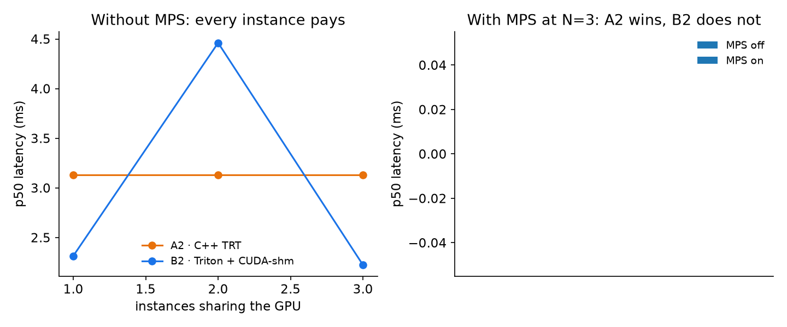

# Contention — N pipelines, one GPU

[← index](../README.md) · prev: [In-graph NMS](in-graph-nms.md) · next: [Manufacturing inspection](inspection.md)

What happens to *your* latency when someone else is using the GPU too.

The short version: **it depends almost entirely on whether CUDA MPS is running**,
and that single switch reverses which pipeline wins.

Raw data: [`results/v3/mps_contention_N3.tsv`](../results/v3/mps_contention_N3.tsv)
and [`results/v3/parallel_contention_N3.tsv`](../results/v3/parallel_contention_N3.tsv) ·
scripts: [`mps_contention.sh`](../scripts/mps_contention.sh),
[`parallel_test.sh`](../scripts/parallel_test.sh).

---

## The measurements

N independent pipeline instances on one GPU, capacity mode, yolov8s FP16. Each
instance measures its own per-frame latency — in capacity mode, so not what a live
camera's frame waits (that is [live traffic](live-batching.md)). A2's clock also
starts before the frame's ~0.25 ms upload and B2's after it, so A2's latencies here
read high against B2's.

**Scaling with N (MPS off):**

| N instances | A2 latency each | B2 latency each | Total fps (A2 / B2) |
|---|---|---|---|
| 1 | 1.24 ms | 1.28 ms | 809 / 654 |
| 2 | 2.10 ms (+69%) | 1.86 ms (+45%) | 950 / 891 |
| 3 | 3.13 ms (+153%) | 2.25–2.30 ms (+76%)* | 957 / 985 |

*\*In the committed N=3 run
([`parallel_contention_N3.tsv`](../results/v3/parallel_contention_N3.tsv)) one of the
three B2 instances ran at 4.46 ms p50 (the other two 2.22 and 2.32). B2's
per-instance latency without MPS is bimodal — see the p95 row below.*

**The MPS A/B at N=3** — same engine, same `frames.bin`, same uid, only the daemon
toggled, 3 repeats per cell:

| N=3 | MPS off | MPS on | Effect |
|---|---|---|---|
| **A2** total fps | 951.8 | **1258.9** | **+32.3%** |
| **A2** latency p50 | 3.145 ms | **2.487 ms** | **−20.9%** |
| **B2** total fps | 977.2 | 993.6 | +1.7% |
| **B2** latency p50 | **2.295 ms** | 2.760 ms | **+20.3% (worse)** |
| **A2** latency p95 | 3.165 ms | **2.779 ms** | −12.2% |
| **B2** latency p95 | 4.505 ms | **2.799 ms** | **−37.9%** |

*p95: median across the 9 instance-runs per cell. Without MPS, 6 of B2's 9 runs had
a p95 near 4.5 ms; with MPS, none did. (p95 rows added 2026-09-29 from the same
TSV.)*

Solo (N=1) A2 is unchanged: 1.254 ms off vs 1.259 ms on — **MPS costs nothing when
there is no contention.**

## Three findings

**1. Latency grows ~linearly with N.** 1.24 → 2.10 → 3.13 ms for A2 is almost
exactly 1×, 1.7×, 2.5×. Without MPS the GPU time-slices between CUDA contexts and
each instance waits its turn.

**2. Whether throughput plateaus at the engine cap depends on MPS.** With the
daemon off, A2 and B2 both flatten around 950–990 fps and it looks like a hardware
ceiling. It isn't: with MPS on, A2 reaches **1258.9 fps against a `trtexec`
batch-1 cap of 1022.98 qps** (1028 published) — 23% *above* the supposed limit. The "cap" was
kernels from separate processes serializing, not the GPU running out. With MPS,
parallel instances genuinely **do** grow the pie.

**3. Triton's contention advantage is real, but only against MPS-less processes.**

- **Without MPS:** B2 (977 fps, 2.295 ms) beats A2 (952 fps, 3.145 ms).
- **With MPS:** A2 (1259 fps) beats B2 (994 fps) by **+26.7%**, and overtakes it
  on latency too, 2.49 vs 2.76 ms — winning on both axes (and A2's clock includes
  the upload that B2's excludes, so the real latency gap is wider).

## Why the two flows react so differently

MPS exists to let **separate processes** share a GPU without serializing on
context switches.

- **A2 is three processes with three CUDA contexts.** Exactly MPS's problem, so it
  wins big.
- **B2 is three *client* processes, but all GPU work happens inside one Triton
  server process** with two model instances. There are no competing contexts for
  MPS to multiplex — so it adds nothing (+1.7%) while its indirection layer
  *costs* ~20% median latency. It does remove B2's slow mode: p95 falls 38%.

So Triton's advantage was never clever scheduling. **It is simply not having
separate contexts to fight** — its single-process, multi-instance design achieves
by construction what MPS achieves by daemon. Which is also why MPS has nothing
left to give it.

## What to actually do

> **Running multiple independent processes on one GPU? Turn MPS on.** +32%
> throughput and −21% latency at N=3, and nothing to pay when uncontended.
>
> **Running Triton? MPS is a median-vs-tail trade** *(corrected 2026-09-29)*.
> +20% p50 (2.30 → 2.76 ms) for −38% p95 (4.51 → 2.80 ms) and +2% throughput.
> Leave it off if you watch the median; try it if you watch the tail. (First
> published as "leave MPS off", from p50 alone.)
>
> **Choosing between them?** Hand-rolled multi-process *with* MPS beats Triton by
> ~27% on throughput here. Without MPS, Triton edges out process-per-stream A2 by
> ~3% (977 vs 952 fps). One A2 process with a thread per stream avoids the
> question: it reaches 1,219 fps in capacity mode ([results](results.md)).

## In-process streams are nearly free

Flow C2 with threads inside one process: **+2–3% latency at N=3** (threads
interleave on one connection), versus +153% for N separate processes without MPS.
If you control the client, in-process concurrency beats process-per-stream — and
it sidesteps the whole MPS question.

## Practical implication

Six live 30 fps cameras need 180 fps of aggregate capacity. Every configuration in
this study covers that with room to spare.

**In capacity mode, contention only becomes real near ~1000 fps.** Live cameras
feel it sooner: B2's per-frame turnaround goes from 1.92 ms at 8 cameras to 4.35 ms
at 32 (960 fps), and one-frame-at-a-time pipelines should stay under ~80% GPU
utilisation ([live traffic](live-batching.md#7-how-busy-the-gpu-was)). Past their
capacity, batching (B3) is what keeps up. Below that, pick your flow on latency and
operational fit, not on contention behaviour.

## What we concluded first, and why it was wrong

The original write-up of this page reported two things that the MPS measurement
later overturned. Kept here because the *reason* they were wrong is the useful
part:

| First conclusion | What was actually going on |
|---|---|
| "Total throughput plateaus at the engine cap (~950–990 fps); parallel instances divide the pie, they don't grow it." | True only with MPS off. The plateau was inter-process serialization, and it reads exactly like a hardware ceiling until you remove it. |
| "Triton shares the GPU more gracefully than raw CUDA contexts" (+76% vs +153% latency growth) | The mechanism was right, the comparison wasn't. A2 was handicapped by a daemon that wasn't running, not out-scheduled. |

Both came from measuring one configuration and generalising. The fix was not a
better analysis of the same data — it was **toggling the one variable nobody had
varied.**

## Caveats

- **MPS: measured for both flows.** Testing B2 needed a non-root Triton container,
  since an MPS client must share the daemon's uid and a root server cannot reach a
  user-owned daemon (`error 805`).
- A leftover MPS daemon breaks *every* root CUDA container on the host with that
  same `error 805` — `mps_contention.sh` tears it down on exit, including on error.
- C2 at N≥4 in-process hit a cross-thread shm race (regions shared between
  threads); those numbers are excluded as invalid. Valid C2 in-process data is
  N≤3.
- Container CUDA state can degrade after very heavy multi-process churn
  (`cudaErrorNoDevice`); recreate the container from the image to recover.

---

[← index](../README.md) · prev: [In-graph NMS](in-graph-nms.md) · next: [Manufacturing inspection](inspection.md)
