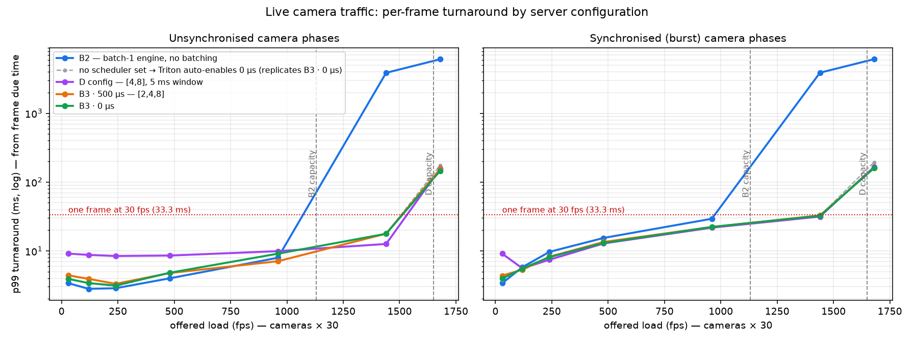
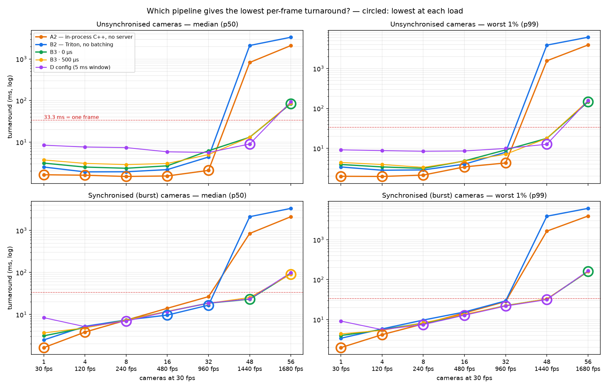
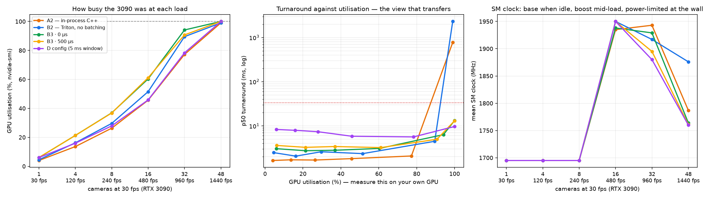

# Live camera traffic — batching that does not make frames wait (B3)

[← index](../README.md) · prev: [Batching](batching.md) · next: [Triton tuning](triton-tuning.md)

Every latency this study published for batching comes from **capacity mode**: a
closed-loop client holding 8 frames in flight per stream. That is the right way to
measure throughput, and it makes latency a queue the client builds itself (see
[batching](batching.md)). A live camera has **at most one frame in flight**, and
nobody had measured what batching does to it.

This page does, with a new flow and a new measurement mode.

Script: [`b3_paced.sh`](../scripts/b3_paced.sh) · client:
[`grpc_client_cuda.cu`](../cpp/src/grpc_client_cuda.cu) (`--mode paced`) · figure:
[`plot_b3.py`](../scripts/plot_b3.py) · raw data:
[`results/v3/b3_paced.tsv`](../results/v3/b3_paced.tsv) — 5 configs × 2 arrival
patterns × 7 camera counts × 3 interleaved repeats, no foreign GPU process in any
run.

!!! abstract "The short version"

    - **Below capacity, batching never makes a frame faster — only slower.** D's
      configuration adds **~5.5 ms** to every live frame. B3 · 0 µs adds **~0.5 ms**
      (B3 · 500 µs ~1 ms). B2 (no batching) is still the fastest by that margin.
    - **In a burst, batching bounds the tail** — up to 24% lower p99.
    - **Past B2's capacity, batching is the difference between working and not**
      — at 48 cameras B2's median frame is **2.1 seconds** late; every batching
      config stays at **9–13 ms**.
    - **The right batch window grows with load.** There is no single best value.
    - **Against A2, on the same clock:** A2 is fastest for normal traffic up to its
      capacity (~1,290 fps). In synchronised bursts of 8+ cameras batching wins,
      because A2's per-camera contexts share the GPU and all finish late together.
      [Selection chart](#6-choosing-a2-b2-or-b3-at-each-load).

---

## Setup

**Paced mode** (`trt_grpc_cuda --mode paced`): N virtual cameras, each producing a
frame every 33.3 ms on its own schedule and sending it the moment it is due —
one frame in flight per camera, as a real camera would. Turnaround is measured
from each frame's **due time**, not from when the request left, so a slow server
cannot hide its own delay by making the client send later (the error known as
coordinated omission). It includes the upload into the shared-memory region,
because a real frame has to get there too.

Two arrival patterns: **unsynchronised** (each camera at a random, seeded phase —
the same phases for every config) and **synchronised** (all cameras fire together
— the worst-case burst).

| Config | Model | Server batching | Role |
|---|---|---|---|
| **B2** | `yolov8s` — batch-1 engine | none (`max_batch_size: 0`) | the no-batching baseline |
| **D config** | `yolov8s_dyn` — batch-8 engine | preferred `[4, 8]`, **5,000 µs** | the published D setting, now under live traffic |
| **B3 · 500 µs** | `yolov8s_dyn` | preferred `[2, 4, 8]`, **500 µs** | batch only frames that arrive close together |
| **B3 · 0 µs** | `yolov8s_dyn` | **0 µs**, no preferred sizes | batch only when both instances are busy |

All four use CUDA shared memory and 2 Triton instances. **B3** is B2's client
pointed at a short-window batcher: batching happens only when frames are already
waiting together, and no frame is held back to be batched.



## 1. Below capacity, batching only adds latency — the window decides how much

Unsynchronised cameras, p50 turnaround (ms):

| Cameras | B2 | B3 · 0 µs | B3 · 500 µs | D config |
|---:|---:|---:|---:|---:|
| 1 | **2.50** | 3.10 | 3.69 | 8.39 |
| 4 | **1.91** | 2.49 | 3.06 | 7.58 |
| 8 | **1.92** | 2.33 | 2.85 | 7.33 |
| 16 | **2.16** | 2.67 | 3.04 | 5.81 |

Every batching config is slower than B2, and the gap splits cleanly into two parts:

- **~0.6 ms is the engine, not the batching.** The batch-8 engine running a single
  frame is slower than a dedicated batch-1 engine — measured at 1 camera, where
  every config forms batches of exactly 1.00. TensorRT tunes kernels for the
  engine's optimisation shape (batch 8); batch 1 runs on them correctly but less
  efficiently.
- **The rest is the window.** 500 µs costs ~0.5 ms; D's 5,000 µs costs ~5 ms. A
  frame arriving alone cannot form a preferred batch, so it waits out the whole
  window before it is sent.

So D's configuration charges every live frame **5.4–5.9 ms** for batches that, at
these loads, barely form. B3 · 0 µs cuts that to **0.4–0.6 ms**, nearly all of
which is the engine.

## 2. In a burst, batching bounds the tail

Synchronised cameras — every frame lands at once:

| Cameras | B2 p99 | B3 · 0 µs p99 | B3 · 500 µs p99 | B2 mean | B3 · 500 µs mean |
|---:|---:|---:|---:|---:|---:|
| 8 | 9.66 | **8.11** | 8.21 | **6.81** | 7.10 |
| 16 | 15.39 | **13.00** | 13.44 | **9.85** | 10.51 |
| 32 | 29.26 | 22.26 | **22.21** | 17.53 | **15.99** |

With B2, a burst of N frames queues behind two instances and the last frame waits
for all the others. Batching sends the burst as a few batches, so the worst frame
finishes sooner — **p99 falls 13–24%**. The price is paid in the mean at 8 and 16
cameras, where every frame in a batch waits for the whole batch; by 32 cameras
batching wins both.

Note how close B2's burst p99 at 32 cameras (29.3 ms) comes to one frame interval
(33.3 ms). Batching keeps a synchronised rig well inside it.

## 3. Past B2's capacity, batching is the difference between working and not

Unsynchronised cameras:

| Cameras (fps) | B2 p50 | B2 p99 | batching configs p50 | batching configs p99 |
|---|---:|---:|---:|---:|
| 32 (960) | 4.35 | 7.92 | 4.97–6.15 | 7.06–9.89 |
| **48 (1,440)** | **2,124** | **3,879** | **8.95–13.04** | **12.59–17.76** |
| 56 (1,680) | 3,357 | 6,121 | 84–94 | 146–157 |

48 cameras sits between B2's capacity (~1,131 fps) and D's (~1,650 fps). B2 cannot
keep up, so its queue grows for the whole run and frames arrive **seconds** late.
Batching raises capacity enough to stay on the flat part of the curve. At 56
cameras (1,680 fps) every config is past capacity and degrades — batching only
moves the wall, it does not remove it.

## 4. The right window grows with load

| Load | Best config (p50) | Mean batch formed |
|---|---|---|
| ≤ 16 cameras | **B3 · 0 µs** | ~1.0 — nothing to batch; any wait is pure cost |
| 32 cameras | **B3 · 500 µs** (4.97 ms, vs 6.15 at 0 µs) | 1.45 vs 1.27 — the window catches enough batch-mates to pay for itself |
| 48 cameras | **D config** (8.95 ms, vs 13.0 for B3) | 4.01 vs ~3.5 — bigger batches are more GPU-efficient, and near capacity efficiency *is* latency |

A window is a bet that company is coming. At low load it rarely is, and the wait
is wasted; near capacity it always is, and the larger batches free enough GPU time
to shorten everyone's queue. **There is no single best `max_queue_delay` — only a
best one for a given load.**

## 5. Triton turns batching on even when you don't ask

The design had a fifth arm: the batch-8 engine with the `dynamic_batching` block
removed, meant as "batching off". It batched — 3.4 per execution in a burst,
7.99 at 56 cameras — identically to B3 · 0 µs. Triton's own report of the
configuration it loaded settles it:

```
dynamic_batching: {"preferred_batch_size": [8], "max_queue_delay_microseconds": 0, ...}
```

**Config auto-complete adds a zero-delay dynamic batcher to any model with
`max_batch_size > 0` that does not name a scheduler.** Leaving the block out does
not disable batching. The reliable ways are `max_batch_size: 0`, or starting the
server with `--disable-auto-complete-config`.

The arm is kept in the data and the figure as what it turned out to be: an
independent second run of the 0 µs config, which it matches. At 1 camera, where
it formed batches of exactly 1.00, it still validly measures the engine's own cost
(+0.64 ms). No published result is affected — every model behind one is either
`max_batch_size: 0` or has batching configured explicitly.

## 6. Choosing: A2, B2 or B3 at each load

A2 was run in the same paced mode — same cameras, same seeded phases, same clock
(from each frame's due time, upload included) — in a second sweep
([`a2_paced.sh`](../scripts/a2_paced.sh) →
[`results/v3/a2_paced.tsv`](../results/v3/a2_paced.tsv)). To show the two sweeps
compare, that sweep re-ran six B2 cells: five reproduce within **0.2–4.1%**, the
sixth (a 32-camera burst, where B2 is at its edge) within **12%**. Gaps smaller than
that in burst cells are treated as ties below.



*Circled: the lowest turnaround at each load. Chart:
[`plot_selection.py`](../scripts/plot_selection.py).*

| Traffic | Cameras (load) | Lowest turnaround | GPU busy (3090) | If you need a server |
|---|---|---|---|---|
| Unsynchronised | 1–16 (≤ 480 fps) | **A2** — 1.48–1.63 ms p50, 0.3–0.9 ms ahead of B2 | 4–46% | **B2** (B3 · 0 µs +0.3–0.6 ms p99) |
| Unsynchronised | 32 (960 fps) | **A2** — 2.07 ms p50, 4.27 p99; half of B2's 4.35 p50 | 77% | **B3 · 500 µs** — 7.06 ms p99 |
| Unsynchronised | 48 (1,440 fps) | **D config** — 8.95 ms p50, 12.59 p99. A2 (827 ms) and B2 (2,124 ms) are past capacity | 100% | D config |
| Synchronised | 1–4 | **A2** | 4–14% | B2 (1 camera) · B3 · 500 µs (4) |
| Synchronised | 8–32 | **batching** — D config lowest p99 at every point; A2 falls behind (16 cameras: 14.03 ms p50 vs B2's 9.65) | 28–78% | D config |
| Any | 56 (1,680 fps) | nothing keeps up — every config ≥ 84 ms p50. Add a GPU | not sampled (already 99–100% at 48) | — |

*At 48 synchronised cameras the chart's ring is a tie, not a winner: B3 · 0 µs and
D config were 0.2 ms apart (23.14 vs 23.35 ms p50) and swapped order in the
[re-check](#re-checked-after-a-client-leak) (24.82 vs 23.36). D config has the lower
p99 in both.*

*GPU busy: `nvidia-smi` utilisation of the winning config at that load (from §7).
Synchronised rows use the same load's figure — average utilisation depends on frames
per second, not on arrival pattern.*

**Why A2 loses in bursts.** A2 gives every camera its own execution context and
CUDA stream, so a synchronised burst of 16 frames launches 16 inferences at once.
The GPU interleaves them and they all finish late together — A2's p50 (14.03 ms) is
nearly its p99 (14.54 ms). Triton runs at most two at a time (2 instances): the
first frames finish early and the last late (B2: 9.65 p50, 15.39 p99). For
identical jobs arriving together, first-come-first-served gives a better average
than sharing — Triton's instance count is quietly acting as admission control.

**Capacities under live traffic:** A2 delivers ~1,290 fps before its queue grows
without bound, B2 ~1,130, and the batching configs ~1,650.

!!! warning "Correction: the A2–B2 latency gap was mis-measured"

    Capacity mode reports A2 at 1.23 ms and B2 at 1.28 ms — "≈ A2 latency". The two
    clocks start in different places: **A2's before the frame's upload to the GPU,
    B2's after it.** On the same clock (paced mode) A2 is **0.3–0.9 ms faster per
    frame** — 1.48–1.63 ms against 1.91–2.50 ms at 1–16 cameras. The Triton tax is
    real, just still small against a 33 ms frame.

## 7. How busy the GPU was

Every config was re-run at each load while sampling `nvidia-smi` every 200 ms inside
the measured window (unsynchronised cameras, one repeat;
[`util_paced.sh`](../scripts/util_paced.sh) →
[`results/v3/gpu_util_paced.tsv`](../results/v3/gpu_util_paced.tsv), figure
[`plot_util.py`](../scripts/plot_util.py)). This is the part that carries over to a
different GPU — see [on another GPU](other-gpus.md).



| Cameras | A2 | B2 | B3 · 0 µs | B3 · 500 µs | D config | SM clock | Power |
|---:|---:|---:|---:|---:|---:|---:|---:|
| 1 | 4.0% | 4.5% | 6.0% | 6.1% | 6.0% | 1,695 MHz | ~115 W |
| 4 | 13.6% | 16.2% | 21.3% | 21.3% | 15.9% | 1,695 MHz | ~130 W |
| 8 | 26.3% | 29.6% | 36.9% | 36.8% | 27.9% | 1,695 MHz | ~145 W |
| 16 | 45.6% | 51.5% | 60.3% | 61.1% | 45.8% | ~1,940 MHz | ~240 W |
| 32 | 77.2% | 89.5% | 94.1% | 90.7% | 78.3% | ~1,880–1,940 MHz | ~325–343 W |
| 48 | 99.0% | 99.0% | 100% | 100% | 100% | ~1,760–1,880 MHz | **~348 W** |

- **Utilisation grows roughly in proportion to load.** A2 costs the least GPU per
  camera; B3 the most at low load, because the batch-8 engine runs single frames
  inefficiently. D's config is as cheap as A2 at 16–32 cameras: its bigger batches
  mean fewer, more efficient executions.
- **One-frame-at-a-time pipelines stay flat until ~80%, then hit a wall.** A2 is
  2.07 ms at 77%; B2 is already 4.46 ms at 90%, nearly double its low-load value.
  **Keep A2 and B2 under ~80% `nvidia-smi` utilisation.**
- **For batching configs, 100% is not the wall.** At 48 cameras they read 100% and
  still turn frames around in 9–13 ms, because a busier GPU forms bigger batches.
  `nvidia-smi` reports that *some* kernel was running, not that there was no capacity
  left.
- **The 3090's wall is partly a power wall.** The SM clock sits at 1,695 MHz up to 8
  cameras, boosts to ~1,950 MHz at 16–32, and falls back to ~1,760–1,880 MHz at 48
  cameras, where the card draws ~348 W against its 350 W limit.
- **One camera is slower than four — but only on the Triton paths** (B2 2.47 vs
  2.06 ms, B3 · 0 µs 3.04 vs 2.73), not in A2 (1.64 vs 1.70), and at the same
  1,695 MHz clock either way. So it is not the GPU: it looks like a wake-up cost on the
  gRPC and server side when requests are sparse.

## Predictions, stated in advance

| # | Prediction | Result |
|---|---|---|
| 1 | Low load: B3 within ~0.5 ms of B2; D config ~4–5 ms worse | **Partly wrong.** B3 · 0 µs +0.4–0.6 ms ✓; D config +5.4–5.9 ms ✓ (slightly more). B3 · 500 µs +0.9–1.2 ms ✗ — the prediction left out the batch-8 engine's own ~0.6 ms |
| 2 | Bursts: batching bounds p99, B2 keeps the better mean | ✓ at 8 and 16 cameras; at 32 batching wins both |
| 3 | 48 cameras: B2 unbounded, batching bounded | ✓ 2.1 s against ≤ 13 ms |
| 4 | B3 · 0 µs batches ~1.0 at low load, rising with load | ✓ 1.00 → 1.01 → 1.27 → 3.57 → 7.98 |

Not predicted: that the best window grows with load (§4), and that Triton enables
batching unasked (§5).

## What changes in the advice

| Situation | Use | Why |
|---|---|---|
| Few cameras, well below capacity, latency is everything | **B2** | ~0.5 ms faster than anything that batches |
| Bursts possible, or load may approach B2's ~1,131 fps | **B3 · 0 µs** | +0.5 ms at low load buys a bounded tail in bursts and survival past B2's capacity |
| Sustained load near capacity | **longer window** (D's config) | bigger batches free GPU time; best p50 at 48 cameras |
| Live cameras at low load | **never D's config** | +5.5 ms on every frame for batches that do not form |

The earlier [use-cases](use-cases.md) advice — *"No batching, ever"* for closed
loops, justified by D's 74 ms — survives in its conclusion and loses its reason.
The real cost of batching a live camera below capacity is **~0.5 ms, not 74 ms**,
and B3 · 0 µs is cheap enough to be worth it wherever a burst or a load spike is
possible.

## Three harness defects this run exposed

- **Every stream loaded its own copy of `frames.bin` (1.47 GB).** Published
  16-stream capacity runs were quietly using 23.5 GB of host RAM; at 32 streams the
  kernel killed the client before it printed anything (exit 137). The B2 client now
  shares one copy, and so do A2's (`ad541a7`) and D's (`97d9b3c`).
- **The sweep's signal handler restored state and then kept running** — unlocked,
  with its backup deleted. The handler now exits, restores from git, and was
  tested on exactly that failure.
- **The container's baked source had drifted from the repo** — it still carried the
  nearest-neighbour resize the [accuracy](accuracy.md) work replaced. Paced mode
  never runs that kernel, so no result here is affected, and the rebuilt binary is
  current.

## Re-checked after a client leak

A fourth defect was found afterwards, in a sibling study that reused this client:
**B2/B3's client (`trt_grpc_cuda`) and D's (`trt_grpc_async`) registered their CUDA
shared-memory regions with Triton and never unregistered them.** Triton kept each
run's GPU buffers mapped after the client exited — measured: 2 regions and +10 MiB
of server GPU memory per camera per run. Every sweep on this page ran with it. The
sweeps restart Triton whenever the batching config changes, so the leak peaked at a
few GB of held memory within one server lifetime, never compute, and no drift shows
across the published repeats. That was an inference, so it was measured.

Both clients now unregister their regions on every exit path, and the sweeps clear
leftovers before each run ([`shm_clear.sh`](../scripts/shm_clear.sh)). A slice of
this page was then re-run with the fixed clients — B2, B3 · 0 µs and D config at 8,
32 and 48 cameras, both phases, the same seeds, plus A2 as a control that never used
Triton — with its predictions committed first
([`leakfix_check.sh`](../scripts/leakfix_check.sh)):

| Prediction | Result |
|---|---|
| P1 — no region left after any run; Triton's memory flat | **held** — 0 leftovers; 2,218 MiB before, between and after |
| P2 — every Triton cell below capacity within ±10% (the cross-sweep anchor spread) | **held** — 23 cells, largest move 8.5%, most under 1%; overloaded cells stayed overloaded |
| P3 — the A2 control within ±10% | **held** — within 4.6% |
| P4 — the same fastest pipeline at every load | **failed on one cell** — 48 synchronised cameras, a 0.2 ms tie that swapped order (see [§6](#6-choosing-a2-b2-or-b3-at-each-load)) |

**No published number on this page moves.** The utilisation figures in §7 were not
re-run: `nvidia-smi` utilisation is GPU busy time, which held memory does not change.

A first attempt at the re-check was stopped: an unrelated CPU-only job (load ~12)
was running on the host, which the GPU lock cannot see, and B2 read 23–29% slow on
identical seeds. Its rows are kept, labelled, and excluded; the script now refuses
to start on a busy host. Paced timings depend on the host CPU as much as the GPU.

Data: `results/v3/leakfix_b3_slice.tsv`, `leakfix_a2_slice.tsv`; comparison
[`leakfix_compare.py`](../scripts/leakfix_compare.py).

## Scope

- YOLOv8s FP16 at 640×640, 30 fps cameras, 2 Triton instances, one RTX 3090.
- Turnaround includes the upload from **pageable** host memory and runs on a GPU
  that is idle most of each frame interval at low load, so absolute paced-mode
  numbers are higher than capacity-mode ones (B2: 2.5 ms here vs 1.28 ms there).
  **Compare configs within this page, not against capacity-mode tables.**
- Synchronised phases are the worst case; real rigs sit between the two patterns.
- An obvious follow-up: build the batch-8 engine with a second, batch-1
  optimisation profile — that could remove most of the 0.6 ms engine cost that
  §1 attributes to every batching config at low load.

---

[← index](../README.md) · prev: [Batching](batching.md) · next: [Triton tuning](triton-tuning.md)
