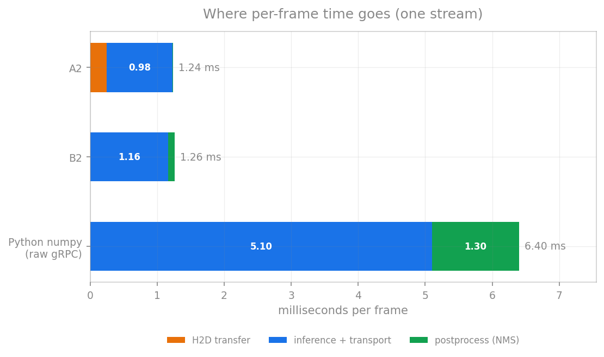

# Where does the time go? — stage decomposition

[← index](../README.md) · prev: [Moving fewer bytes](fewer-bytes.md) · next: [Model cost](model-scaling.md)

Per-stage wall time for one frame, measured inside each flow with per-stage timers
(`stages_ms` in every binary's JSON output). Concurrency 1, YOLOv8s.

---



A2 and B2 look nearly the same here, but they are not on the same clock: A2's
timer includes its 0.25 ms upload and B2's starts after it. Measured on one clock
(live cameras, paced, upload included), A2 is **0.3–0.9 ms faster per frame**
([live traffic](live-batching.md#6-choosing-a2-b2-or-b3-at-each-load)). The Python
bar is five times longer, and the extra length is all client-side: gRPC
serialisation plus numpy NMS, not GPU work.

## Capacity mode (preprocessed frames, no decode — pure pipeline cost)

| Stage | A2 (C++ TRT) | B2 (Triton, CUDA shm) | Python client (numpy, labelled C2 — see note) |
|---|---|---|---|
| Host→Device transfer | **0.25 ms** (H2D, pinned+async) | 0 on its timer (the upload happens before B2's clock starts) | 0 |
| Preprocess | 0 (already preprocessed input) | 0 | 0 |
| Inference (GPU) + output handling | **0.98 ms** (incl. compact kernel) | 1.16 ms (gRPC round trip incl. server infer) | 5.1 ms (gRPC + serialize) |
| Postprocess (NMS, CPU) | 0.01 ms | 0.10 ms | 1.3 ms (numpy NMS) |
| **Total** | **1.25 ms** | **1.26 ms** | **6.4 ms** |

*Note on the Python column (corrected 2026-09-29):*
[`results/stage_decomposition.tsv`](../results/stage_decomposition.tsv) labels it
C2, but it is not C2 as published (numpy + system shared memory, **1.69 ms** at
concurrency 1, [results](results.md)). It was measured with the Python client in
RTSP mode, and in that mode [`client_v2.py`](../triton/client_v2.py) always sends
the tensor over raw gRPC — its `--transfer sys` option applies only to file
replay. So this column is C2's numpy preprocessing and NMS with B1-style
transport, which is why it shows a 5.1 ms "gRPC + serialize" stage and lands on
C1's 6.4 ms. The chart above now labels it that way.

The engine itself is 0.97–0.98 ms everywhere. A2 adds 0.25 ms H2D + 0.01 NMS.
B2's infer stage is 0.18 ms longer than A2's, but B2's upload is outside its timer;
on the same clock the gap is 0.3–0.9 ms *(corrected 2026-09-29: this line
previously called 0.18 ms the entire Triton framework cost; see
[live traffic](live-batching.md#6-choosing-a2-b2-or-b3-at-each-load))*.
The Python column's gap is client-side: gRPC round trip with serialisation (5.1 ms
against a 0.98 ms engine) + Python NMS (1.3 ms).

## RTSP end-to-end mode (adds decode; includes source pacing)

*One camera. For live-camera latency at many cameras — open loop, timed from each
frame's due time, upload included — see [live traffic](live-batching.md). The Python
column carries the same caveat as above: its 5.08 ms is a raw-gRPC transfer, not
C2's system shared memory.*

| Stage | A2 (C++ full-CUDA) | B2 (Triton, CUDA shm) | Python client (numpy, labelled C2) |
|---|---|---|---|
| Decode (NVDEC / pipe) | 0.15-0.4 ms compute (rest = waiting for 30fps frame) | same | ffmpeg pipe ≈ 33.3 ms wall (pacing) |
| Preprocess | **0.15 ms** (fused CUDA kernel) | 0.15 ms | **1.26 ms** (numpy CPU) |
| Infer + transfer | 1.22 ms | 1.71 ms (gRPC) | 5.08 ms (gRPC raw) |
| Postprocess | 0.001 ms | 0.001 ms | ~1-3 ms |
| **GPU-only total** | **≈1.4 ms** | **≈1.9 ms** | **≈7.5 ms** |

## The architectural tax, stacked

Starting from the engine's honest price, each hop adds:

```
raw engine ..................... 0.97 ms   (the GPU's honest price)
+ in-process C++ wrapper ....... +0.26 ms  → A2: 1.23 ms   (our code, CUDA kernels, NMS)
+ Triton server + gRPC ......... +2.0  ms  → B1: 3.27 ms   (copies + scheduling)
+ Python client ................ +3.1  ms  → C1: 6.4  ms   (interpreter, GIL, torch)
```

The +2.0 ms of "Triton server + gRPC" is mostly copies, and copies are fixable —
[transport](transport.md) shows CUDA shm removing most of it. What remains for B2,
on the same clock as A2, is 0.3–0.9 ms per frame
([live traffic](live-batching.md#6-choosing-a2-b2-or-b3-at-each-load)).

## Four facts that fall out

**Decode is free at 30 FPS.** NVDEC decodes a frame in ~0.2–0.4 ms; for the rest
of the 33 ms interval the decoder *waits*. In the C++ flows the "decode" timer
reads ~31.9 ms — that is socket-read blocking, not compute. Do not optimize it.
That is per camera: across a fleet the decoder has a fixed capacity, ~768 fps at
1080p (~25 cameras on a 3090), below the detector's, so at 1080p it is the first
limit ([decoder capacity](nvdec.md)).

**The fused CUDA preprocess kernel (0.15 ms in this run) is ~6.5–8× faster than
numpy-on-CPU (1.26 ms)** — and numpy is already the *fast* Python option; torch was
worse.

> Measured when the kernel still used nearest-neighbour interpolation. It now
> interpolates bilinearly, which costs **+0.0085 ms** and recovers 1.25% mAP; the
> stage re-measured at 0.186 ms (nearest) → 0.1945 ms (bilinear), ~6.5× faster than
> numpy — see [accuracy](accuracy.md). The stage remains far from the bottleneck.

**The framework tax lives only in the infer stage.** B2 pays 1.16–1.71 ms where A2
pays 0.98–1.22.

**CPU vs GPU split.** In A2, ~99% of pipeline time is GPU work. In the Python
column, much of client time is CPU (serialisation + 1.3 ms of numpy NMS) — the GPU
sits idle waiting for its next frame.

> **At one frame in flight, the GPU is mostly waiting.** Here the fight is over
> PCIe round trips, serialisation and interpreter locks. Under load it saturates:
> 77% busy (A2) at 32 live cameras, 100% at 48, and power-limited there
> ([live traffic §7](live-batching.md#7-how-busy-the-gpu-was)).
> *(corrected 2026-09-29: previously "the GPU is almost never the bottleneck at the
> edge".)*

## Note on the output tensor

The engine writes a `[1,84,8400]` FP32 output, **2.8 MB per frame**. A2/B2/D
reduce it on the GPU with a compact kernel before anything crosses to the host;
the Python clients ship it whole. Folding NMS into the engine shrinks it 392x at
the cost of an 18.6% slower engine — a net +33% on a raw-gRPC path
([in-graph NMS](in-graph-nms.md)).

---

[← index](../README.md) · prev: [Moving fewer bytes](fewer-bytes.md) · next: [Model cost](model-scaling.md)
